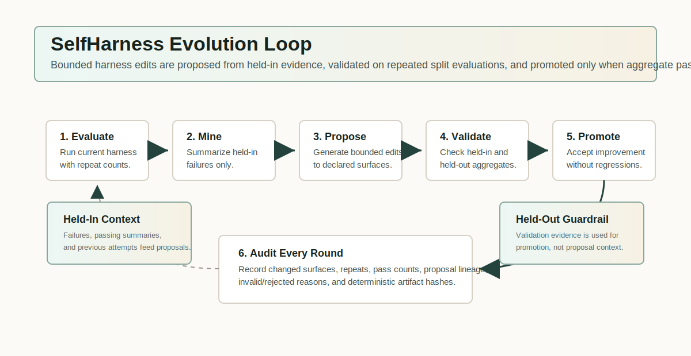
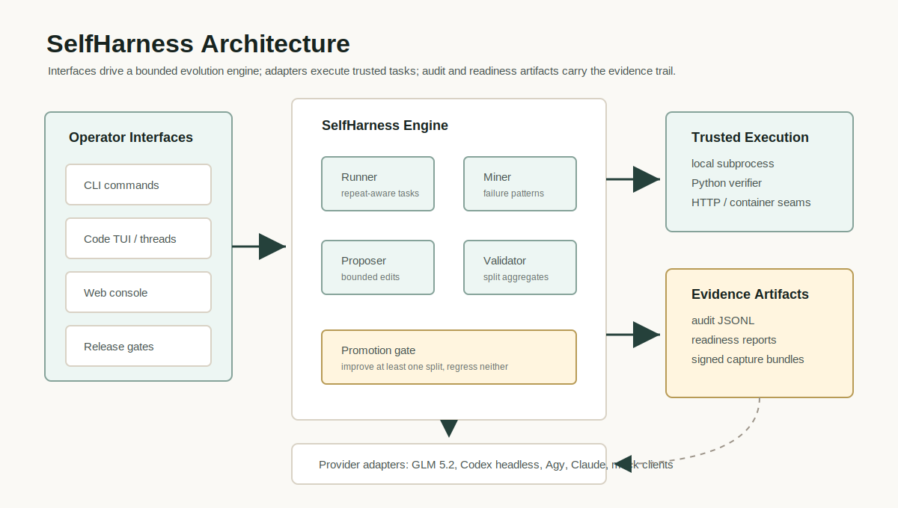

# SelfHarness

SelfHarness is a paper-faithful, audit-first implementation of the
Self-Harness protocol from "Self-Harness: Harnesses That Improve Themselves"
(arXiv:2606.09498). It is built for real agentic evaluation on trusted corpora:
repeat-aware evaluation, bounded harness edits, held-in/held-out validation,
and explicit artifact trails.

[](LICENSE)



## What It Does

SelfHarness lets an agent improve the harness that guides its future work,
while keeping every proposed change bounded, validated, and auditable. The core
project runs without API keys, and provider-backed workflows can be connected
through explicit operator configuration.

The implementation follows the paper loop:

1. Run a fixed harness on held-in and held-out tasks with repeated attempts.
2. Mine verifier-grounded failure patterns from held-in failures only.
3. Pass held-in failure patterns, held-in passing summaries, and previous edit
   attempts to a bounded proposer context.
4. Propose bounded harness edits against declared editable surfaces.
5. Validate every candidate on both splits using aggregate pass counts.
6. Promote only edits that improve at least one split without degrading the other.
7. Write deterministic audit artifacts for every round.

The harness model declares paper-aligned surfaces for system/bootstrap/execution/
verification/failure-recovery instructions, runtime policy, tools, skills,
memory sources, and subagents. The deterministic runner only exercises the
instruction and runtime-policy surfaces; the remaining surfaces are present so
production adapters can target the same harness shape.

## What It Does Not Claim

This repository is not a Terminal-Bench reproduction by itself. Live benchmark
reproduction remains gated on operator-owned live artifacts, signed capture
material, readiness evidence, provider/backend preflights, and bundle
verification. The local gates intentionally keep `reproduction_claimed: false`
until that evidence exists.

## Architecture At A Glance



The public docs are organized for two audiences:

- Researchers can start with the paper loop, editable surfaces, audit schema,
  and reproduction boundary.
- Operators can start with the CLI, trusted-corpus workflow, release gates,
  readiness matrix, and Minerva deployment notes.

Start with [docs/README.md](docs/README.md) for the full reading path.

## Quick Start

```bash
.venv/bin/python -m pip install -e .
.venv/bin/self-harness demo --rounds 3 --seed 0 --out runs/demo
```

Or, from an activated environment after installing the package:

```bash
self-harness demo --rounds 3 --seed 0 --out runs/demo
```

Useful demo controls:

```bash
self-harness demo \
  --rounds 3 \
  --seed 0 \
  --evaluation-repeats 2 \
  --max-proposals 8 \
  --max-payload-bytes 600 \
  --out runs/demo
```

Summarize a completed audit directory:

```bash
self-harness audit-summary runs/demo
```

Verify a completed audit directory's internal consistency:

```bash
self-harness audit-verify runs/demo --json --out dist/self-harness-audit-verify.json
```

Verify an existing live Harbor audit against signed provenance:

```bash
self-harness audit-verify-live \
  --audit-dir ops/live-audit \
  --live-harbor-audit ops/live_harbor_audit.json \
  --provenance ops/live-audit-provenance.json \
  --provenance-signature ops/live-audit-provenance.sig \
  --public-key keys/live-audit-provenance.ed25519.pub \
  --require-signature \
  --json
```

Compare two audit directories byte-for-byte:

```bash
self-harness audit-diff runs/demo-a runs/demo-b --json
```

Write a paper-style trajectory view from an audit directory:

```bash
self-harness audit-trajectory runs/demo
```

Inspect retained harness edits and final surfaces from an audit directory:

```bash
self-harness inspect-harness runs/demo
self-harness inspect-harness runs/demo --json
```

Build a paper-style benchmark report from completed audit directories:

```bash
self-harness benchmark-report \
  --audit-dir minimax:runs/minimax-final \
  --audit-dir qwen:runs/qwen-final \
  --audit-dir glm:runs/glm-final \
  --out runs/benchmark-report.json
```

Validate a versioned task corpus:

```bash
self-harness validate-tasks examples/local_corpus.json --min-per-split 1
```

Require an Ed25519-signed corpus:

```bash
self-harness validate-tasks examples/local_corpus.json --require-corpus-signature keys/corpus.ed25519.pub
```

Generate an offline signing keypair and sign a corpus:

```bash
self-harness corpus-keygen --out keys/corpus.ed25519
self-harness corpus-fingerprint --public-key keys/corpus.ed25519.pub
self-harness corpus-sign \
  --corpus examples/local_corpus.json \
  --private-key keys/corpus.ed25519 \
  --out examples/local_corpus.signed.json
self-harness validate-tasks examples/local_corpus.signed.json \
  --require-corpus-signature keys/corpus.ed25519.pub
```

Use a passphrase-protected private key for operator-held production signing
material:

```bash
export CORPUS_KEY_PASSPHRASE="use-a-secret-manager-in-real-ci"
self-harness corpus-keygen --out keys/corpus.ed25519 --passphrase-env CORPUS_KEY_PASSPHRASE
self-harness corpus-sign \
  --corpus examples/local_corpus.json \
  --private-key keys/corpus.ed25519 \
  --passphrase-env CORPUS_KEY_PASSPHRASE \
  --out examples/local_corpus.signed.json
```

`--passphrase-file` is also supported. `--passphrase` exists for local
operator use, but shell history makes it the wrong choice for CI.

For KMS, HSM, YubiKey, or platform-keychain custody, wrap the provider with the
external signer protocol instead of exporting signing material to this project:

```bash
self-harness corpus-sign \
  --corpus examples/local_corpus.json \
  --external-signer "python path/to/kms_signer_wrapper.py" \
  --signer-provider aws-kms \
  --key-id alias/self-harness-corpus \
  --fingerprint 0123456789abcdef0123456789abcdef0123456789abcdef0123456789abcdef \
  --out examples/local_corpus.signed.json
```

The external signer receives only the canonical corpus integrity payload over
stdin and returns a standard Ed25519 signature plus public-key provenance. The
signed corpus envelope remains verification-compatible with
`--require-corpus-signature` and keyrings.

Maintain trusted corpus public keys in an operator-held keyring:

```bash
self-harness corpus-keyring init --out keys/corpus.keyring.json
self-harness corpus-keyring add \
  --keyring keys/corpus.keyring.json \
  --corpus-id local-smoke \
  --public-key keys/corpus.ed25519.pub \
  --label environment=ci
self-harness validate-tasks examples/local_corpus.signed.json \
  --require-corpus-keyring keys/corpus.keyring.json
```

During a signing-key rotation, add the new public key as `active`, then move old
keys to `retired` or `revoked`:

```bash
self-harness corpus-keyring set-status \
  --keyring keys/corpus.keyring.json \
  --corpus-id local-smoke \
  --fingerprint <old-public-key-fingerprint> \
  --status retired
```

Version and promote operator-owned release policy files:

```bash
self-harness operator-promotion init --manifest ops/promotion.json
self-harness operator-promotion add \
  --manifest ops/promotion.json \
  --name image_policy \
  --kind image_policy \
  --file ops/image_policy.json \
  --status candidate
self-harness operator-promotion set-status \
  --manifest ops/promotion.json \
  --name image_policy \
  --status active
self-harness operator-promotion sign \
  --manifest ops/promotion.json \
  --private-key keys/operator-promotion.ed25519 \
  --public-key keys/operator-promotion.ed25519.pub \
  --out ops/promotion.json.sig
self-harness operator-promotion verify \
  --manifest ops/promotion.json \
  --signature ops/promotion.json.sig \
  --trusted-public-key keys/operator-promotion.ed25519.pub \
  --json
```

Promotion manifests bind local operator policy paths to SHA-256 digests and
monotonic lifecycle states. They are release/operator material, not audit
artifacts or benchmark reproduction evidence. See
`docs/operations/operator_promotion.md`.

Verify that the bundle paths and promotion digests still refer to the same
active policy files:

```bash
python scripts/operator_policy_binding_verify.py \
  --bundle ops/operator_bundle.json \
  --promotion ops/promotion.json \
  --signature ops/promotion.json.sig \
  --trusted-public-key keys/operator-promotion.ed25519.pub \
  --result-out dist/self-harness-operator-policy-binding.json
```

This is an offline release/operator consistency check; it does not contact live
services or claim benchmark reproduction. See
`docs/operations/operator_policy_binding.md`.

Pre-validate local PyPI/Sigstore attestation material before including it in a
release-candidate evidence bundle:

```bash
make attestation-check
self-harness verify-attestation \
  --bundle dist/self-harness-pypi-attestation.json \
  --material "$(ls dist/*.whl)" \
  --trust-root tests/fixtures/attestations/trust_root.json \
  --backend structural \
  --out dist/self-harness-attestation.json
```

The structural backend checks local attestation shape, material digests,
certificate identity, and transparency-log fields. It does not contact Fulcio,
Rekor, PyPI, Sigstore, Harbor, Docker, registries, scanners, models, or cloud
providers, and `cryptographic_valid` is intentionally `null`. See
`docs/operations/attestations.md`.

Operators with a real canonical Sigstore bundle and a full Sigstore client
trust config can install `self-harness[sigstore]` and run the same command with
`--backend sigstore` for offline cryptographic verification.

Track live production blockers without probing live systems:

```bash
make readiness-matrix
make readiness-drift-check
make readiness-promotion-check
make reproduction-readiness-check
```

This validates `docs/operations/readiness_matrix.json` and writes
`dist/self-harness-readiness-matrix.json`. The drift check writes
`dist/self-harness-readiness-drift.json` by cross-checking provisioned,
reproduction-relevant entries against existing offline preflight artifacts. The
promotion check compares a baseline and candidate readiness catalog without
mutating either file, then records whether provisioned transitions are
evidence-backed. The
reports record whether live Terminal-Bench, Harbor, Docker, scanner, PyPI,
Sigstore, paper model backend, or signer dependencies are blocked, optional,
or provisioned. The paper model backend rows track MiniMax M2.5,
Qwen3.5-35B-A3B, and GLM-5 separately; Anthropic remains an optional package
adapter seam.
Run `make model-backend-preflight` to write the model-backend surface report in
dry-run mode without contacting providers. Operators can set
`MODEL_BACKEND_PREFLIGHT_MODE=live` plus the provider endpoint/credential
environment to validate live reachability. See
`docs/operations/model_backend_preflight.md`.
Run `make container-preflight` to write the Docker surface report in offline
mode without contacting the Docker daemon or inspecting images. That report is
advisory while Docker remains blocked; promotion requires an operator-owned
live container preflight artifact.
The PyPI row is wired to the installed-wheel `release_smoke` surface while it
remains blocked, so smoke status is installability evidence rather than trusted
publishing validation. These reports are release/operator material and do not
claim benchmark reproduction. See `docs/operations/readiness_matrix.md`.
The Sigstore row similarly treats structural attestation as advisory while
blocked; promotion requires `--backend sigstore` with
`cryptographic_valid: true`.

`make reproduction-readiness-check` writes
`dist/self-harness-reproduction-readiness.json`, mapping the paper's live
benchmark-readiness requirements to the current readiness matrix and artifact
evidence. It is expected to report `reproduction_ready: false` until live
Harbor, Docker, paper model backend, network-control, artifact-ingest, PyPI,
and Sigstore material exists. See
`docs/operations/benchmark_reproduction_readiness.md`.
Before a live run, author and sign the operator capture plan with
`scripts/capture_manifest_build.py` and `scripts/sign_capture_manifest.py`, or
use `self-harness capture-manifest build`. Rehearse the signed plan offline
with `scripts/capture_rehearsal.py` or `self-harness capture-manifest
rehearse` before contacting live services. After the live run, convert raw
operator outputs into artifact-class JSON with `scripts/capture_extract.py` or
`self-harness capture-extract`, including the fixed 64-case split via
`--split-manifest-result` and the paper protocol declaration via
`--fixed-protocol-declaration`. The protocol declaration includes model,
evaluator, tool budget, Self-Harness rounds, and proposal width. Paper-faithful
captures also include proposer LLM request-log evidence and a
`proposer_context_manifest` summarizing the editable surfaces, held-in failure
patterns, passing behavior summaries, and previous attempted edits supplied to
each proposer round. Context manifests include task-id coverage for held-in
failure patterns and passing behavior summaries; bundle verification rejects
context task ids that drift from the held-in split/evaluation evidence. The
extracted live audit and two-repeat evaluation artifacts are also bound to the
fixed protocol artifact by
`fixed_protocol_sha256`. Operators can then run
`scripts/capture_admit.py` or `self-harness capture-admit` to produce one
admission report binding raw inputs, extracted artifacts, bundle verification,
and optional readiness evaluation. Finally, bind the supplied live artifacts with
`scripts/reproduction_bundle_build.py`, sign them with
`scripts/sign_reproduction_bundle.py`, and verify with
`scripts/reproduction_bundle_verify.py` or `make
reproduction-readiness-bundle-verify`. The bundle manifest records one
SHA-256/byte-size-checked artifact per required class and is signed in the hard
gate path. `make reproduction-bundle-check` performs build, sign, and signed
verification when the operator supplies bundle metadata and signing material.
After live Harbor artifacts are ingested, run `self-harness audit-verify-live`
or `make audit-verify-live` to create the `audit_verify_report` artifact class;
the default replay verifier remains release evidence only. See
`docs/operations/audit_verify_live.md`.
Run `make capture-extract-check` for the offline extractor test path. See
`docs/operations/capture_extract.md`. The extractor path includes proposer
request-log and proposer-context manifests for paper-faithful bundles, in
addition to the split, protocol, audit, preflight, trust, and network-control
artifacts.
Run `make capture-admit-check` for the offline admission-orchestrator path. See
`docs/operations/capture_admit.md`.

Run local verifier-backed subprocess tasks from a corpus:

```bash
self-harness local-demo --corpus examples/local_corpus.json --rounds 1 --evaluation-repeats 2 --out runs/local-demo
```

Run trusted in-process Python verifier tasks from a corpus:

```bash
self-harness python-demo examples/local_corpus.json \
  --trust-verifier-module tests/fixtures/in_process_verifier.py \
  --rounds 1 \
  --evaluation-repeats 2 \
  --out runs/python-demo
```

`python-demo` executes only the verifier module explicitly supplied by the
operator. Corpus JSON may include an opaque `verifier_selector` metadata string
for that trusted module to interpret, but corpus JSON never selects Python code.
This path is useful for structured verifier outcomes without shell commands; it
is still not a benchmark reproduction.

Run trusted HTTP verifier tasks from a corpus:

```bash
self-harness http-demo examples/local_corpus.json \
  --trust-verifier-url http://127.0.0.1:8080/verify \
  --rounds 1 \
  --evaluation-repeats 2 \
  --out runs/http-demo
```

`http-demo` sends deterministic JSON POST requests to the operator-supplied
verifier URL and expects the same structured verifier result shape as
`python-demo`. Corpus JSON may carry `verifier_selector`, but it may not carry
URLs or endpoints. Tests use only a local `127.0.0.1` server; there is no
default external network dependency.
For HTTPS verifiers, operators may add `--tls-ca-bundle`, `--tls-client-cert`,
and `--tls-client-key`; corpus JSON cannot select TLS material or headers.

Run trusted container verifier tasks in daemon-free dry-run mode:

```bash
self-harness container-demo examples/local_corpus.json \
  --trust-container-image ghcr.io/example/verifier:latest \
  --fixture-dir tests/fixtures/container_verifier \
  --rounds 1 \
  --evaluation-repeats 2 \
  --out runs/container-demo
```

Optionally require an operator-owned image allowlist and digest pin:

```json
{
  "policy_version": "1",
  "entries": [
    {
      "image": "ghcr.io/example/verifier:latest",
      "digest": "sha256:aaaaaaaaaaaaaaaaaaaaaaaaaaaaaaaaaaaaaaaaaaaaaaaaaaaaaaaaaaaaaaaa",
      "status": "active",
      "labels": {
        "purpose": "local-smoke"
      }
    }
  ]
}
```

```bash
self-harness container-demo examples/local_corpus.json \
  --trust-container-image ghcr.io/example/verifier:latest \
  --trust-container-image-digest sha256:aaaaaaaaaaaaaaaaaaaaaaaaaaaaaaaaaaaaaaaaaaaaaaaaaaaaaaaaaaaaaaaa \
  --image-policy keys/container-images.policy.json \
  --require-image-digest \
  --fixture-dir tests/fixtures/container_verifier \
  --rounds 1 \
  --evaluation-repeats 2 \
  --out runs/container-demo
```

`container-demo` defaults to `--mode dry-run`, constructs deterministic
`docker run` command specs, and replays operator-provided verifier fixtures. In
`--mode live`, it writes `preflight.json` and exits before engine rounds if the
Docker CLI or daemon is unavailable. Corpus JSON may not choose container
images, digests, commands, entrypoints, Docker arguments, registry auth, env
files, or Docker config paths. In live mode, `--env-file` and `--docker-config`
are operator-only inputs for private verifier images or secrets. `--env` is
retained for non-secret values; secret values should use `--env-file` so they
are not placed in `docker run` argv or traces. `--image-policy` is also
operator-only runtime material; it is enforced in dry-run and live modes before
audit rounds and is not copied into corpus JSON, manifests, or audit JSONL.
`--require-image-digest` rejects execution unless the supplied image digest uses
the strict `sha256:<64 lowercase hex>` form.

Run the experimental Terminal-Bench-shaped dry-run adapter:

```bash
self-harness terminal-bench \
  --mode dry-run \
  --dataset terminal-bench@2.0 \
  --manifest tests/fixtures/terminal_bench/manifest.json \
  --fixture-dir tests/fixtures/terminal_bench \
  --rounds 2 \
  --out runs/tb-dry-run
```

This dry-run command exercises the benchmark protocol boundary and writes
schema `1.3` benchmark provenance. It is still not a Terminal-Bench
reproduction and does not run the published benchmark task set.

Check whether live Harbor execution is provisioned:

```bash
self-harness terminal-bench-preflight \
  --dataset terminal-bench@2.0 \
  --manifest tests/fixtures/terminal_bench/manifest.json \
  --out runs/tb-preflight \
  --json
```

If a required live dependency is missing, preflight writes `preflight.json` and
exits non-zero before any benchmark audit rounds are created. Live
`terminal-bench --mode live` runs the same preflight gate before the engine
loop.

Task corpus JSON shape:

```json
{
  "corpus_version": "1",
  "corpus_id": "local-smoke",
  "tasks": [
    {
      "id": "local-pass",
      "split": "held_in",
      "failure_mode": "local_subprocess",
      "description": "write and verify an answer file",
      "metadata": {
        "solve_command": "printf ok > answer.txt",
        "verify_command": "test -f answer.txt",
        "timeout_seconds": 30
      }
    },
    {
      "id": "local-held-out",
      "split": "held_out",
      "failure_mode": "local_subprocess",
      "description": "verify a held-out command",
      "metadata": {
        "solve_command": "true",
        "verify_command": "true",
        "timeout_seconds": 30
      }
    }
  ]
}
```

Legacy files shaped as `{"tasks": [...]}` still work through the deprecated
positional `local-demo tasks.json` path. Production corpora should include
`corpus_version` and `corpus_id`.

Production corpora may also include `checksum` and `signature`. The checksum
and Ed25519 signature cover the canonical payload made from `corpus_version`,
`corpus_id`, and `tasks`; the `checksum` and `signature` fields themselves are
metadata outside that payload. Install `self-harness[provenance]` or the dev
extra to enable key generation, signing, fingerprinting, and signature
verification. Private keys are operator-held files and are never written into
corpus JSON or audit artifacts. Private keys may be generated as unencrypted
PKCS8 PEM for compatibility or as encrypted PKCS8 PEM with an explicit
passphrase source.
Corpus keyrings embed public keys, stable fingerprints, statuses, and labels;
they also never contain private key material. Only `active` keyring entries can
verify a signed corpus.

The demo is deterministic and intentionally includes one rejected candidate:
an overly broad bootstrap rule improves a held-in task but regresses held-out,
so the validation gate blocks it.

This project does not reproduce the paper's Terminal-Bench-2.0 experiments yet.
It implements the algorithmic protocol against a synthetic runner so the core
contracts are inspectable without model keys, Docker, Harbor, or DeepAgent. The
local subprocess adapter preserves the paper-shaped verifier protocol with fresh
per-attempt work directories, but it is still not a Terminal-Bench reproduction.

The trusted in-process Python adapter preserves the same repeated-attempt
evaluation protocol while returning structured verifier outcomes directly. It
requires an explicit trusted module path or dotted module name from the operator
and rejects unknown failure categories rather than silently extending audit
semantics.
The trusted HTTP adapter preserves the same structured outcome contract for
service-backed verifiers with explicit operator-supplied endpoints and strict
timeouts.
The trusted container adapter adds the container execution seam while keeping
dry-run deterministic and live execution preflight-gated. Container image policy
enforcement covers both `container-demo` and the experimental Terminal-Bench
path. The Harbor path verifies operator-pinned image identity before execution
and parsed live container digests after each task invocation.

## Production Status

The project has a release-oriented readiness gate:

```bash
make readiness
```

The gate runs paper-fidelity invariant tests and checks the canonical
deterministic audit hash. CI runs both `make check` and `make readiness` across
Python 3.11, 3.12, and 3.13.
Tag-based release automation builds distributions only after both gates pass;
release-candidate tags such as `v0.1.1-rc.1` dry-run the workflow without
publishing.

Release policy is documented in `RELEASE.md`. The readiness gate does not claim
benchmark reproduction; it proves that the local implementation preserves the
paper-aligned protocol invariants and deterministic audit contract.

## LLM Proposer

The provider-neutral `LLMProposer` can be used with any client implementing
`complete(system_prompt: str, user_prompt: str) -> str`. A reference Anthropic
Claude adapter is available behind an optional extra:

```bash
python -m pip install -e '.[anthropic]'
```

```python
from self_harness.adapters.llm import AnthropicClaudeClient
from self_harness.llm_proposer import LLMProposer

proposer = LLMProposer(AnthropicClaudeClient("claude-sonnet-4-5"))
```

The package also exposes offline-testable contract clients for the paper
backends: `MiniMaxClient`, `QwenClient`, and `GLMClient`. They require an
operator-supplied chat-completions transport before any live request can run.
The `self-harness model-preflight` command (and the equivalent
`scripts/model_backend_preflight.py`) wraps those clients for dry-run, replay,
and explicit live checks:

```bash
self-harness model-preflight --backend glm --mode replay              # offline fixture
ZAI_API_KEY=<secret> self-harness model-preflight --backend glm --mode live
```

GLM 5.2 is driven through the **Z.ai GLM Coding Plan** by default: its
Anthropic-compatible Messages endpoint (`https://api.z.ai/api/anthropic`),
authenticated with `ZAI_API_KEY`. The harness translates the proposer's
OpenAI-shaped request to the Messages wire format and back, so the coding-plan
subscription works without prepaid API balance. Set
`ZAI_BASE_URL=https://api.z.ai/api/paas/v4` to use the pay-as-you-go
OpenAI-compatible endpoint instead. See `docs/operations/web_interface.md`.

## Agentic Runner (real GLM 5.2 task solving)

`self-harness glm-agentic-demo` runs the loop with a **real agentic runner**:
GLM 5.2 solves each task as a tool-using agent (bash/read_file/write_file) under
the candidate harness, in an isolated workspace, and the **Codex CLI** judges
success. Harness edits therefore change genuine task-success rates — this is the
paper's real experiment, not a string-matching oracle.

```bash
export ZAI_API_KEY="<z.ai coding-plan key>"   # GLM 5.2 solver + proposer
# requires the Codex CLI on PATH (codex login) as the judge
self-harness glm-agentic-demo examples/agentic_corpus.json \
  --proposer glm --rounds 2 --max-steps 12 --out runs/glm-agentic
```

> The agent executes model-generated shell commands **directly on the host**
> (no container). Run only with trusted corpora. Outcomes are stochastic, so
> agentic-runner audits are not byte-reproducible — unlike the deterministic
> `demo`/`python-demo` runners. It is real agentic evaluation, and is **not** a
> Terminal-Bench reproduction (different task set, no Harbor). Full details:
> `docs/operations/agentic_runner.md`.

## Coding Agent CLI (`self-harness code`)

`self-harness code` is an interactive coding-agent TUI for your terminal. It can
run GLM 5.2 through Z.ai or delegate the main coding turn to headless local CLIs
(`codex`, `agy`, or `claude`) while still driving every turn with the active
**self-improving harness**. It opens a multi-turn session in the current
directory, persists conversation threads, and gives you an out-of-band control
plane so model/provider/config changes are never sent to the model as chat.
The reply streams into a rich terminal UI with markdown, per-tool-call status,
and a thinking spinner; pipe the output or pass `--plain` for plain text.

```bash
export ZAI_API_KEY="<z.ai coding-plan key>"
self-harness code                      # in your project directory
self-harness code --resume             # continue your most recent session
```

Inside the TUI, type `/` to open the slash-command menu, use Up/Down to choose
a command, and press Enter to accept it. `/menu` opens the command palette; the
palette reaches the same controls as the slash commands:

```text
/menu                         open the command palette
/model                        TUI picker for provider/model/effort
/model codex gpt-5.6 xhigh    set provider/model/effort directly
/provider claude              switch provider
/effort xhigh                 set reasoning effort where the provider supports it
/threads                      thread picker
/thread new                   start a clean conversation thread
/thread switch <id-or-number> switch to a saved thread without leaving the CLI
/config                       runtime settings picker
/status                       show cwd, thread, harness, provider/model, harvest, budgets
/history [n]                  show recent turns
/save                         persist current thread immediately
/clear                        clear the screen
/reset                        clear current thread history
/exit, /quit, /q, :q           leave the CLI
Ctrl-C                        at prompt: exit; during a turn: interrupt and return to prompt
```

Provider defaults can also be set before launch:

```bash
self-harness settings set code_provider codex
self-harness settings set code_model gpt-5.6
self-harness settings set code_effort xhigh
```

The older `settings set model codex|agy|claude|glm-5.2` compatibility path is
still accepted, but new installs should prefer `code_provider`, `code_model`,
and `code_effort`.

What makes it different from a static-harness CLI: it closes a **self-improvement
flywheel**. Every failing check/build/test command GLM hits during a session is
harvested into the shared inbox (`runs/inbox/`) as a learnable task. Run the
continuous loop (`self-harness ui`, *Start continuous loop*) and those real
failures become held-in tasks that evolve the harness — so the agent gets better
*at your codebase* the more you use it. Both commands share one
`runs/harness_state.json`, so improvements flow straight back into the CLI.

Type `@path/to/file` in a message to inline that file's contents into the turn.
Threads persist under `runs/sessions/` and can be resumed at startup with
`--resume [id]` or switched live with `/threads`. Flags: `--root`,
`--harness-state`, `--inbox-dir`, `--max-steps`, `--tool-timeout-seconds`,
`--no-harvest`, `--resume [id]`, `--plain`. Auto-run executes model-generated
commands directly on the host (no container) — use it on repos you trust.
See `docs/operations/code_cli.md` for the complete control-plane reference.

> `self-harness code` is the one component with terminal-specific runtime
> dependencies: `rich` for rendering and `prompt_toolkit` for slash-command
> selection. They are imported lazily by the CLI UI module.

## Operator Console

`self-harness ui` serves a single-page operator console (stdlib HTTP server,
locally-vendored Alpine.js — works offline, no build step) for launching and
inspecting runs, using GLM 5.2 as a real development agent, and evolving the
harness:

```bash
self-harness ui --proposer glm --host 127.0.0.1 --port 8765 --root . --runs-dir runs
```

Three top-level views:

- **Runs** — launch a real **agentic** run where GLM 5.2 solves a task corpus with
  `bash`/file tools and the Codex CLI judges each result (so promoted edits change
  genuine pass rates).
  Promoted harness edits **persist and auto-load** as the next run's starting point
  (the harness evolves across sessions); a gated **Promote → source** action writes
  an evolved harness back into `initial_harness()` with a diff preview, backup, and
  ruff/mypy/round-trip gate that auto-restores on failure.
- **Dev task** — hand GLM 5.2 a described task (instructions + Codex success
  criteria, optional workspace files, or "use this repo as the workspace") and watch
  it solve with real tools, Codex-judged.
- **Chat** — talk to and direct GLM 5.2 directly.

It also shows per-round trajectory with accept/merge badges, a round drill-down over
the mined evidence bundle and proposals, an initial-vs-final harness diff, GLM token
usage, and a live GLM reachability banner. Agentic and dev-task runs execute
model-generated commands on the host (no container); run only trusted inputs. It
never claims benchmark reproduction. Full details and the JSON API are in
`docs/operations/web_interface.md`.


The proposer prompt renders held-in failure evidence only: pattern id, cluster
support, representative task ids, symptoms, verifier evidence, and inferred
mechanism. Fabricated pattern IDs and duplicate primary targets are audited as
invalid proposals instead of being silently promoted.

## Experimental Terminal-Bench Integration

The `self_harness.adapters.terminal_bench` package is an experimental scaffold
for speaking the current Terminal-Bench/Harbor protocol shape. It includes a
manifest-to-`TaskCorpus` adapter, a pure harness-to-agent-config renderer, and a
`HarborRunner` with deterministic `dry-run` mode. Live Harbor execution is
best-effort until a captured live run fixture exists.

The live path is guarded by `terminal-bench-preflight`. On machines without
Harbor or a reachable Docker daemon, the preflight report is the correct
artifact; the engine loop does not run. On a provisioned machine,
`terminal-bench-capture` can capture a single Harbor task into a replay fixture
that can later be used with `terminal-bench --mode dry-run`.
Captured fixtures record the manifest task's `task_source_hash`; dry-run replay
refuses to use a captured fixture if the current manifest row has changed.

Live command construction follows the documented Harbor protocol shape:

```bash
self-harness terminal-bench \
  --mode live \
  --dataset terminal-bench@2.0 \
  --manifest path/to/manifest.json \
  --agent claude-code \
  --model anthropic/claude-opus-4-1 \
  --n-concurrent 4 \
  --keep-run-dir runs/tb-live-artifacts \
  --out runs/tb-live
```

Optionally pin Harbor live runs to an operator-owned image policy and expected
container digest:

```bash
self-harness terminal-bench \
  --mode live \
  --dataset terminal-bench@2.0 \
  --manifest path/to/manifest.json \
  --harbor-executable harbor \
  --image-policy keys/harbor-images.policy.json \
  --trust-container-image ghcr.io/example/terminal-bench:latest \
  --trust-container-image-digest sha256:aaaaaaaaaaaaaaaaaaaaaaaaaaaaaaaaaaaaaaaaaaaaaaaaaaaaaaaaaaaaaaaa \
  --require-image-digest \
  --out runs/tb-live
```

The policy file uses the same `policy_version="1"` shape as `container-demo`.
Harbor currently reports a live container digest but not a stable image name in
the supported parser shape, so the trusted image name must come from the
operator. The parsed live digest is verified against the operator-pinned digest
and/or policy; policy material is not copied into audit artifacts.

Inspect and ingest preserved Harbor artifacts:

```bash
self-harness harbor-inspect runs/tb-live-artifacts --out runs/tb-live-artifacts/inspection.json
self-harness harbor-ingest runs/tb-live-artifacts \
  --manifest path/to/manifest.json \
  --out runs/tb-live-ingested
```

Audit manifests from this path include `benchmark_protocol`,
`benchmark_dataset_version`, `harbor_version`, `container_image_digest`, and
`reproduction_claimed=false`. The readiness gate rejects any audit manifest that
combines `benchmark_protocol="terminal-bench@2.0"` with
`reproduction_claimed=true`.
Benchmark reports also reject incomplete provenance for reproduction claims;
values such as `unknown-live` can summarize readiness runs but cannot support a
paper reproduction claim.

## Audit Output

Each run writes:

- `manifest.json`
- `lineage.json`
- `rounds/<n>/harness_before.json`
- `rounds/<n>/harness_after.json`
- `rounds/<n>/patterns.json`
- `rounds/<n>/proposals.jsonl`
- `rounds/<n>/evaluations.jsonl`
- `trajectory.jsonl` when `audit-trajectory` is written
- `harness_inspection.json` when `inspect-harness` is written

All JSON is written with stable key ordering so repeated runs with the same
seed can be compared byte-for-byte.

`rounds/<n>/patterns.json` persists the mined evidence bundle `B_t` — the
held-in failure patterns (support, representative task ids, symptoms, verifier
evidence, and the full `(c, q, m)` signature) handed to the proposer — so the
cross-case evidence grounding each proposal is independently auditable rather
than only referenced by `pattern_id`. Per-record evaluation rows persist all
three signature components (`terminal_cause`, `causal_status`, `mechanism`) so
the deterministic clustering is reconstructable from `evaluations.jsonl` alone.

Proposal rows include `changed_surfaces`, aggregate split scores, pass counts,
`evaluation_repeats`, `decision_reason`, and rejected/invalid candidate reasons.
Derived live proposal-validation manifests additionally record
`validation_failure_category` for invalid candidates, distinguishing
`no_editable_surface` from `execution_failure`.
When proposer context evidence is bundled for paper reproduction, its
failure-pattern and passing-summary task ids are verified against same-round
proposal-validation baseline task outcomes, not the final two-repeat
evaluation. Optional failure-pattern categories are also bound to the
same-round baseline task-outcome terminal failure categories. Optional
`causal_status_sha256` values bind previous attempted edits back to the prior
round failure-pattern causal status for the paper signature component `q`.
Optional `shared_symptoms_sha256` and `verifier_evidence_sha256` values preserve
the paper's failure-cluster symptom and verifier-evidence context without
storing raw traces in shaped bundles. Optional `presentation_order` and
`actionability_hint_sha256` values preserve the paper's support/actionability
cluster ordering contract; `support_rank` is derived from cluster size and is
not stored.
Proposal-validation candidates are checked against that same-round proposer
context: targeted mechanisms must come from held-in failure patterns, changed
surface hashes and names must bind to declared editable surfaces, and
mechanism/surface signatures must be distinct within a round.
Evaluation rows include per-attempt records with `attempt_index` plus split
totals, `terminal_cause`, and `failure_category`. Manifest files include
`schema_version`, `surface_whitelist`, `surface_kinds`, and `op_whitelist`.

Use `self_harness.audit.load_audit_run()` and
`self_harness.audit.summarize_audit_run()` for supported audit readback.
`self-harness audit-trajectory` derives a stable paper-style evolution trace
from those artifacts without re-running tasks. `self-harness inspect-harness`
derives a stable retained-edit report with per-round hashes, committed ops,
reverse ops, proposal statuses, and final harness surfaces. Schema policy and
changelog live in `docs/architecture/audit_schema_policy.md` and
`docs/architecture/schema_changelog.md`.

## Development

Install the package and development tools:

```bash
python3 -m venv .venv
.venv/bin/python -m pip install -e '.[dev,provenance,anthropic]'
```

Run the production check stack:

```bash
make check
```

Individual commands:

```bash
make lint
make typecheck
make test
make readiness
make readiness-matrix
make readiness-drift-check
make readiness-promotion-check
make reproduction-readiness-artifact-shape-lint ARTIFACT_DIR=dist/reproduction-artifacts
make reproduction-readiness-check
make capture-manifest-build
make capture-rehearsal
make capture-manifest-check
make capture-manifest-diff-check
make model-backend-preflight
make audit-verify
make operator-check
make operator-promotion-check
make operator-policy-binding-check
make attestation-check
make migration-check
make build
make reproducible-build-check
make smoke
make release-smoke
make release-candidate-evidence-reproduction
```

The package uses a `src/` layout, ruff for linting, mypy for type checking, and
pytest for tests. CI runs the same lint, typecheck, test, and readiness gates.
`make audit-verify` creates a deterministic local audit under `dist/` and
verifies its manifest, lineage, harness hashes, proposal/evaluation rows, and
paper-fidelity leakage boundaries.
`make operator-check` and `make migration-check` are standalone offline
production gates for operator policy bundles, operator policy promotion,
operator policy binding, and audit migration fixtures.
`make readiness-promotion-check` compares the checked-in readiness catalog
against a candidate catalog and feeds the default release-candidate evidence
path as an advisory gate.
`make reproducible-build-check` rebuilds the wheel from the source distribution
and writes `dist/self-harness-reproducible-build.json` so package release
candidates prove sdist-to-wheel reproducibility before publishing.
`make reproduction-readiness-artifact-shape-lint` validates supplied live
benchmark-reproduction artifact shapes without contacting live infrastructure.
`make capture-manifest-build`, `make capture-rehearsal`,
`make capture-manifest-check`, and `make capture-manifest-diff-check` exercise
the operator pre-capture plan authoring, signed verification, synthetic bundle
rehearsal, and post-capture plan-vs-bundle diff contracts. They are standalone
advisory gates and do not claim benchmark reproduction.
`make smoke` builds the wheel and installs it into an isolated environment,
then runs the installed CLI, verifies the installed package can reproduce the
canonical Figure 3 audit hash, and writes
`dist/self-harness-release-smoke.json`. `make release-smoke` combines the
source gates, readiness gate, build, release-candidate evidence, and wheel
smoke check.

## Stable API

The stable public API is:

- `__version__`
- `EngineConfig`
- `SelfHarnessEngine`
- `Runner`
- `Proposer`
- `LLMClient`, `LLMProposer`
- `MockLLMClient`
- `AnthropicClaudeClient`
- `LLMClientError`, `LLMRequestError`
- `ProposalPolicy`
- `TaskAdapter`
- `TaskCorpus`, `TaskLoadReason`, `load_corpus`, `corpus_checksum`,
  `corpus_integrity_payload`, `verify_corpus_signature`
- `audit_tree_hash`, `audit_trajectory_rows`, `write_audit_trajectory`
- `verify_audit_run`, `audit_verification_report_to_jsonable`
- `AuditVerificationReport`, `AuditVerificationCheck`, `AuditVerificationError`
- `ReadinessMatrixCatalog`, `ReadinessMatrixEntry`, `ReadinessMatrixReport`,
  `ReadinessMatrixRow`, `ReadinessMatrixError`,
  `load_readiness_matrix_catalog`, `evaluate_readiness_matrix`,
  `readiness_matrix_report_to_jsonable`
- `ReadinessDriftReport`, `ReadinessDriftCheck`, `ReadinessDriftError`,
  `evaluate_readiness_drift`, `readiness_drift_report_to_jsonable`
- `inspect_harness_run`, `write_harness_inspection`
- `build_benchmark_report`, `write_benchmark_report`
- `AuditRun`, `AuditSummary`, `load_audit_run`, `summarize_audit_run`
- `ExternalSignerResponse`, `ExternalSignerError`, `ExternalSignerFailure`,
  `sign_corpus_with_external_signer`
- `PromotionManifest`, `PromotionEntry`, `PromotionSignature`,
  `PromotionVerificationReport`, `PromotionError`, `init_promotion_manifest`,
  `add_promotion_entry`, `set_promotion_status`, `sign_promotion_manifest`,
  `verify_promotion_manifest`
- `PolicyBindingReport`, `PolicyBindingCheck`, `verify_policy_binding`,
  `policy_binding_report_to_jsonable`
- `AttestationTrustRoot`, `PyPIAttestation`, `SigstoreBundle`,
  `AttestationVerificationReport`, `AttestationError`, `verify_attestation`,
  `SigstorePythonVerifier`, `attestation_report_to_jsonable`
- `ImagePolicy`, `ImagePolicyEntry`, `ImagePolicyDecision`,
  `ImagePolicyStatus`, `ImagePolicyError`, `load_image_policy`,
  `evaluate_image_policy`, `ensure_image_allowed`, `validate_image_digest`
- dataclasses in `self_harness.types`
- exceptions in `self_harness.exceptions`

Production adapters live under `self_harness.adapters`. `LocalSubprocessTaskAdapter`
is the reference adapter for local verifier-backed corpora.
`self_harness.testing.MockLLMClient` is a deterministic no-network helper for
adapter and audit tests; it is not a model-quality proxy.

Use `LLMProposer` with any provider client implementing:

```python
complete(system_prompt: str, user_prompt: str) -> str
```

The core package does not depend on a provider SDK. Invalid model JSON or
invalid proposed ops are dropped safely; ungrounded and duplicate LLM proposals
are audited as invalid candidates with explicit reasons.

## Sources

- Paper: https://arxiv.org/abs/2606.09498
- Article: https://venturebeat.com/orchestration/researchers-introduce-self-harness-a-framework-that-lets-ai-agents-rewrite-their-own-rules-boosting-performance-up-to-60/

## License

SelfHarness is released under the MIT License. See [LICENSE](LICENSE).
